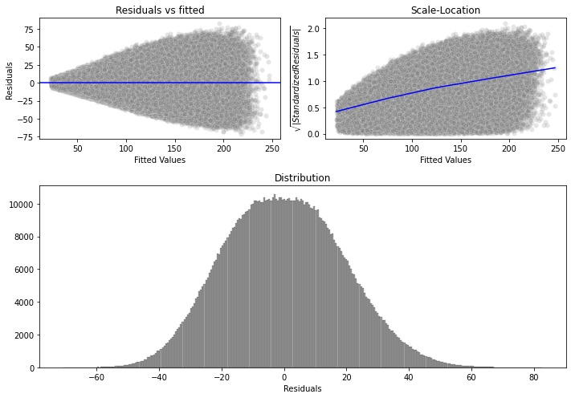

# What's my worth?
***Salary prediction project***


[**`View live app here`**](https://swiles-salary-prediction.herokuapp.com/): *It may take a moment to load, if the app is idle.*

# Contents
* [1. Why estimate salaries?](#1-why-estimate-salaries)
* [2. Data](#2-data)
* [3. EDA](#3-eda)
* [4. Model development](#4-model-development)
    * [4.1  Baseline](#41-baseline-model)
    * [4.2 Machine learning](#42-machine-learning)
* [5. Deployment](#5-deployment)
    * [5.1 React front-end](#51-react-front-end)
    * [5.2 Flask API](#52-flask-api)
* [6. Conclusion](#6-conclusion)
* [7. Project Structure](#7-project-structure)

---

# 1. Why estimate salaries?

Many job seekers utilize websites such as LinkedIn or Indeed when searching for new opportunities. But the majority of jobs posted do not include salary information. **This makes it difficult to decide whether a job is worth applying to or where to expect salary negotiations to start, especially when looking for jobs in different cities.**

For example, consider evaluating two different jobs. One job is in the middle of a big city, the other in a smaller rural town. You could readily compare the cost of living between the two locations on websites like [bestplaces.net](https://www.bestplaces.net/cost-of-living/). But without having an estimated salary, it is harder to determine what kind of lifestyle you could have in either location. A job that even has a high-end salary would probably not feel as sufficient in Silicon Valley versus Cincinnati, OH.

This project aims to solve this problem by creating a predictive model to estimate salaries given a set of features that describe a job. The steps of the process are outlined below.


# 2. Data

The dataset contains information from 1 million job listings.

Features:
- `jobId`: (primary key) - Unique identifier for each job.
- `companyId`: Company identifier for each job.
- `jobType`: Describes the senority or rank of the job. (i.e. Junior, Senior, Manager, CEO).
- `degree`: Highest degree obtained. (i.e. None, Bachelors, Doctoral).
- `major`: Specific field of study in school. (i.e. Engineering, Business).
- `industry`: Which industry the job is a part of. (i.e. Finance, Service).
- `yearsExperience`: Years of experience, ranging from 0-24.
- `milesFromMetropolis`: Distance from city center, ranging from 0-99.
- `salary`: (target) - Listed in 1000s of dollars, as the unit of measurement.

#### Features not used for modeling:

- `jobId`: This is a unique identifier for each job, and won't provide much value.
- `companyId`: If the goal of this model was to predict salaries for only a certain set of companies, then this feature would be useful. However, we aim to predict salaries for any given company. So we will not use this feature here.


# 3. EDA

Here I will highlight some key insights from data analysis. For a more thorough analysis, I recommend checking out the notebook.

**Link to notebook:** [github](./notebooks/1.0-data-exploration.ipynb) | [nbviewer](https://nbviewer.org/github/scottwiles/salary_prediction/blob/main/notebooks/1.0-data-exploration.ipynb)

### 3.1 Target - Salary


The distribution of salaries looks pretty normal, but a little right-skewed. We can also see that there are some values of 0.

Further analysis of the extreme `salary` values:
- Entries with 0 salary:
    - There were `5` total instances here, there was no obvious pattern and so these rows were marked for removal during preprocessing.
- Highly paid `JUNIOR` roles:
    - I found some jobs marked as `JUNIOR` that were among the top 0.5% of all salaries. However, these jobs had an average `yearsExperience` of `21`. It was decided that these are not outliers or data errors.

### 3.2 Key insights

**Salary vs Job Type and Industry**  


There are some findings from analysis that seem pretty intuitive. The above chart of `salary` vs. `jobType` and `industry` is an example. We can see that as the rank or position of a job increases (i.e. junior vs senior vs manager), the average salary also increases; and that education or service industry jobs pay less on average than finance or oil. 

**Salary vs Major**


When looking at the average salary per major, we can see that just having a degree, and therefore having a major listed, is associated with a big increase in average salary. In fact the major value of `LITERATURE`, which has the lowest average salary other than `NONE`, is well above the overall median salary while having `NONE` major is well below the overall median salary.


It is also apparent here that the dataset contains far more examples of `major` being `NONE`, than any of the other levels.

**Salary vs Industry and Major**

*Differences across industries*


This is one outcome of the analysis that I found to be genuinely insightful and not so intuitive.

When looking at average salaries vs. industry and major we can see that:
- In the `SERVICE` industry, it pays more to have a `BUSINESS` major. 
- In the `AUTO` industry, it pays more to have an `ENGINEERING` major.
- In the `HEALTH` industry, it pays more to have `CHEMISTRY` or `BIOLOGY` majors.
- In the `WEB` industry, it pays more to have `ENGINEERING`, `MATH`, or `PHYSICS` majors.
- In the `FINANCE` and `OIL` industries, it pays more to have `BUSINESS` or `ENGINEERING` majors. 

*****

# 4. Model development

Evaluation metric: `Mean Squared Error (MSE)`
 
The modeling process started with a simple baseline using a couple of heuristics to make predictions without machine learning. This ended up giving a decent benchmark performance for more advanced methods to measure up against.

Moving to more advanced methods, multiple machine learning algorithms were tested and evaluated. `XGBoost` ultimately provided the best performance, and was selected to use for deployment.

## 4.1 Baseline model

**Link to notebook:** [github](./notebooks/2.0-baseline-model.ipynb) | [nbviewer](https://nbviewer.org/github/scottwiles/salary_prediction/blob/main/notebooks/2.0-baseline-model.ipynb)

The baseline model uses a couple of simple rules to estimate salaries. It feels appropriate to take grouped averages of categorical variables such as `jobType` or `industry` and use these averages to make predictions on new data. 

Addtionally what I saw in the analysis of the numeric variables `milesFromMetropolis` and `yearsExperience` is that the averages across each value follow a gradual and predictable change. Refer to the [nbviewer link here](https://nbviewer.org/github/scottwiles/salary_prediction/blob/main/notebooks/1.0-data-exploration.ipynb#Miles-from-metropolis) for an illustration. These findings gave me the inspiration to use the relative difference between the grouped averages in these values and the overall average salary. 

*Calculating the relative differnce:*
1. Overall average salary in the data set is `$116k`
2. Average salary for `0` `yearsExperience` is `$92k`
3. The relative differnce is therefore: `$92k - $116k = -$24k`

To illustrate this in more detail. Here is what the prediction behavior looks like for all values of `yearsExperience`.


We can see that values around `12` `yearsExperience` are close to the overall average and will not change the final prediction by much. Values close to `0` or close to `24` will decrease or increase the predicted amount by the most, respectively.


Let's run through a full example by predicting the salary of a `MANAGER` with `0` `yearsExperience`.

**Baseline prediction steps:**
1. `$115k` starting point - the overall average `MANAGER` salary.
2. Add `-$24k` - the relative difference of `0` `yearsExperience` vs overall.
3. The final predicted salary in this case is then: `$91k`


But which categorical variables do we use as our starting grouped average? And what about if we are using both of the numeric variables in our prediction? Do we combine both relative differences? It could be problematic to combine both of these relative differences, if they both lie on the extreme ends. For example, if both numeric variables say to add `$20k` to the salary this means that the numeric variables could influence the overall salary by `$40k` or more.

These questions influenced my design of the baseline model tests. I chose to try two methods of combining the relative differences in the numeric variables: add them together, or take the mean. By using the mean those extreme cases might be more mitigated. And as for the categorical variables, I tested all `15` possible combinations.

**Baseline model test results:**

For each combo of categorical groupings I tested: 
- Only using the grouped average.
- Using one or the other numeric variable.
- Using both combining them by either adding them or averaging them.


#### The best performing baseline model scored `371.22` MSE.

**Insights from testing 75 variations**

- **Both numeric variables:**
    - Using `sum` to combine the numeric diffs gives lower MSE than using `mean` - *in every instance*
- **1 numeric variable:**
    - Using `yearsExperience` gives a lower MSE than `milesFromMetropolis` - *in every instance*
- **2 or 3 categorical variables:**
    - When `jobType` is __not__ a part of the categorical variables, the MSE is much higher than when it is included


## 4.2 Machine learning

**Link to notebook:** [github](./notebooks/3.0-ML-model-development.ipynb) | [nbviewer](https://nbviewer.org/github/scottwiles/salary_prediction/blob/main/notebooks/3.0-ML-model-development.ipynb)

**Models selected for evaluation:**
- Linear regression
- Random forest
- Gradient boosted trees (XGBoost)

Modeling was conducted using 5-fold cross validation.

First I scored the models against the baseline with basic hyperparameter settings:

| Model             | Train Score | Test Score | Test-Train Diff |
|:------------------|:-----------:|:----------:|----------------:|
| Linear Regression |   384.38    |   384.40   |      0.02       |
| Random Forest     |   302.61    |   375.33   |     72.72       | 
| Baseline Model    |   371.29    |   371.22   |     -0.07       | 
| XGBoost           |   352.26    |   358.50   |      6.24       |

Our baseline model scored a lower MSE than both linear regression and a random forest with default hyperparameters. The XGBoost performed the best here, in terms of test set score, however the random forest model seems to have fit the training data a lot better. So I chose to take both the random forest and XGBoost for hyperparameter tuning; maybe with some tuning and regularization, the random forest could out perform the XGBoost.

**Random forest hyperparameter tuning:**

|                       | Train Score | Test Score | Test-Train Diff |
|:----------------------|:-----------:|:----------:|----------------:|
| Default Random Forest |   302.61    |   375.33   |      72.72      |
| Tuned Random Forest   |   346.24    |   374.65   |      28.41      |

Found parameters: { max_depth: 15, n_estimators: 150, min_samples_leaf: 25 }

The disparity between training and test set scores was reduced with tuning and the model generalizes better. But the test set score was only improved slightly to `374.65`. And based on various validation curves that were plotted, it doesn't look too promising to lower the score much further.

**XGBoost hyperparameter tuning:**

|                 | Train Score | Test Score | Test-Train Diff |
|:----------------|:-----------:|:----------:|----------------:|
| Default XGBoost |   352.26    |   358.50   |      6.24       |
| Tuned XGBoost   |   352.32    |   355.24   |      2.92       |

XGBoost parameters can be viewed [here](./references/xgboost_v1_params.json)

The test score has been improved from `358.50` to `355.24`. Additionally the disparity between the the train and test set scores has been lowered and the model generalizes better than the default XGBoost.


#### XGBoost Residuals:



- The residuals follows a pretty normal distribution overall. 
- The standard deviation of the residuals grows as a function of the fitted values.
    - The model predictions are more consistent and accurate on lower-salaried jobs.
- The size of the residuals also tends to grow larger as a function of the fitted values.


#### XGBoost Feature Importances


`jobType` and `yearsExperience` are the most important features for predicting salaries, using this model.


# 5. Deployment

The web app is deployed on Heroku linked here: **[`Live app`](https://swiles-salary-prediction.herokuapp.com/)**

This project makes use of Docker, for easy deployment into a cloud environment.

- [View Dockerfile](./Dockerfile)

Once the API and front-end are ready for deployment, the docker image can be built and/or the image can be pushed to Heroku.
- [Deployment details](./references/deployment.md)


## 5.1 React front-end

The main UI framework was created using the MUI React library: [check it out @ mui.com](https://mui.com/)

[](https://swiles-salary-prediction.herokuapp.com/)

## 5.2 Flask API

The file `./api/app.py` defines the flask app, and it makes use of two main routes for predictions:

* `/single-prediction`:
    - Accepts a JSON string, where the keys are each of the feature names, and the values hold the details of the job to be predicted.
    - Returns single salary in an array.
* `/multiple-prediction`: 
    - Accepts an array of JSON objects, where each object holds the same information as in single-predict mode but with an added `id` attribute.
    - Returns a JSON object where keys are id's matching id's in the webapp, and values are the predicted salaries.
---

# 6. Conclusion

In this project we have explored data from job postings, as well as built and deployed a predictive model to Heroku. Job seekers can now make use of the webapp as a tool to understand what kind of salary they can expect with their individual set of credentials and location relative to a metropolis area.

Future opportunities for improvement include, but are not limited to, improving the model and expanding the deployment infrastructure to handle larger bulk predictions. As for model improvement, I think exploring [feature engineering](./notebooks/3.5-xgboost-model-improvement.ipynb) options is a great starting point as our model needs less overall error; this could also help with making higher-end salary predictions more consistent and accurate. This project can also easily be extended for use in a corporate HR setting, if we expand the computational power of the cloud environment to support larger bulk predictions. 

# 7. Project Structure

[**`Environment setup`**](./references/environment-setup.md): Instructions to recreate both python and React environments.

```
|   Dockerfile
|   deployment_requirements.txt
|   requirements.txt
|   setup.py
├── api
│   ├── app.py         <- Flask app.
│
├── front-end          <- Main React webapp folder.
|
├── img                <- Plots and figures.
|
├── models             <- Saved and exported models.
│
├── notebooks          <- Jupyter notebooks.
│
├── references         <- Data dictionaries, manuals, and all other explanatory materials.
│
├── src                <- Custom methods and classes used for EDA, model development and evaluation.

```
